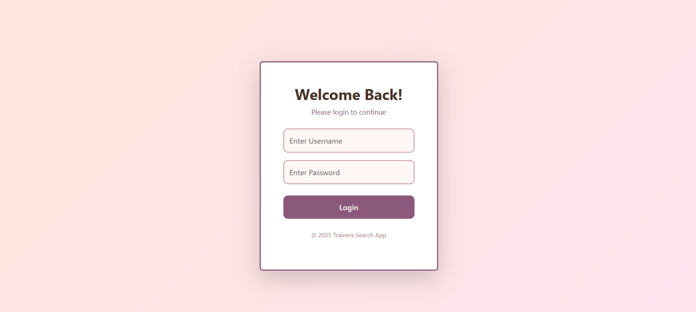
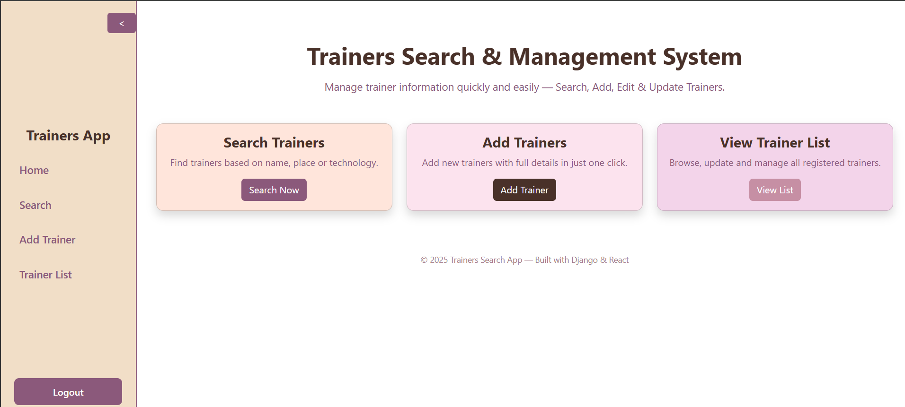
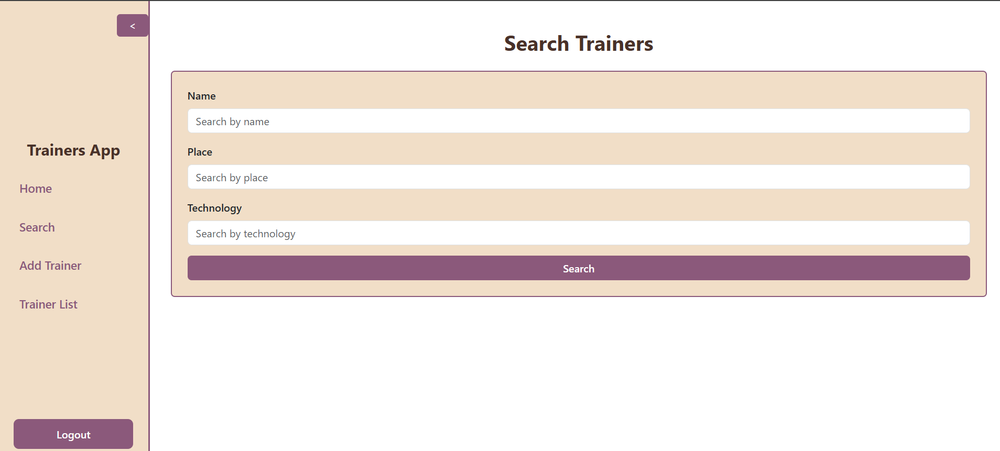
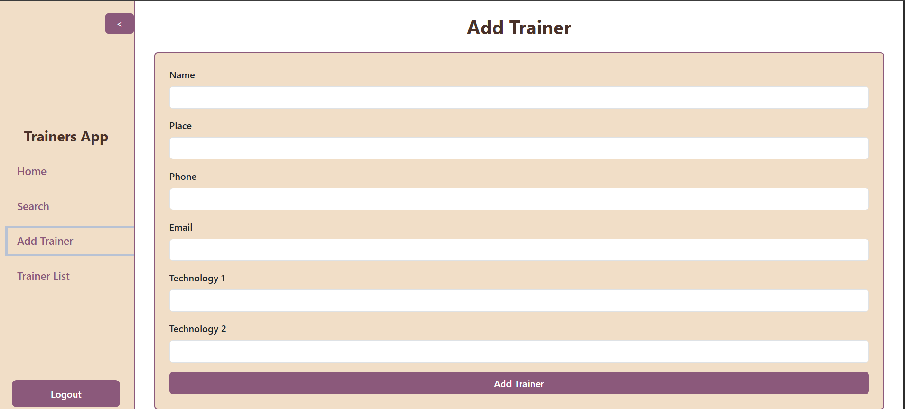
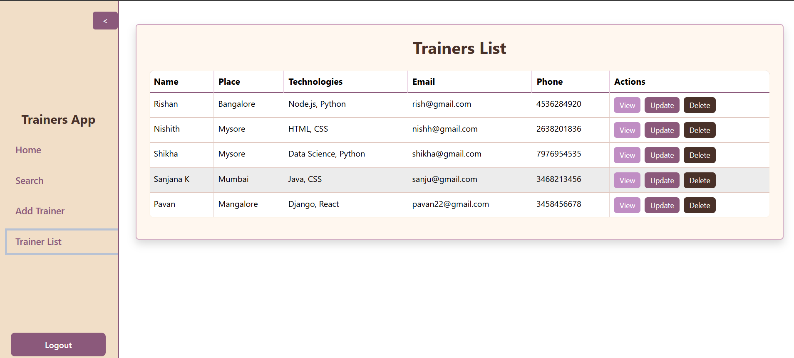

# Trainers Search App

A full-stack web application built with Django REST Framework (backend) and React (frontend). It enables users to securely log in, and then search for, add, update, and delete trainer profiles.

---

## Tech Stack

**Backend**  
- Django + Django REST Framework  
- JWT authentication using SimpleJWT  
- CRUD APIs for trainer resources (Create, Read/Search, Update, Delete)  
- Pagination & filtering support for listing trainers  
- CORS configured for client consumption  

**Frontend**  
- React  
- Login/authentication flow  
- Search trainers  
- Add new trainer form  
- Trainer list with update/delete capability  
- React Router for navigation  
- Axios for API requests  
- Responsive UI design  

---

## Features

### Backend  
- JWT Authentication (login → obtain token → protected endpoints)  
- Trainer CRUD endpoints:  
  - Add a new trainer  
  - List/search trainers (with pagination & filters)  
  - Update an existing trainer  
  - Delete a trainer  
- CORS handling so the React frontend can call the API  
- Support for SQLite (default) and easily switchable to MySQL  

### Frontend  
- User login / token storage  
- Search interface: find trainers by name / criteria  
- Trainer list view: display existing trainers, with update/delete actions  
- Add Trainer form: input trainer details and submit to API  
- Update Trainer: edit existing trainer details  
- Delete a trainer: remove trainer entry  
- Responsive layout: works well on desktop and mobile  

---

## Project Structure

```
TRAINER-S-SEARCH-APP/
│
├── backend/
│   └── trainers_search_app/
│       ├── myenv/                       # Virtual environment
│       │
│       ├── trainers/                    # Django app containing Trainer CRUD logic
│       │   ├── **pycache**/
│       │   ├── migrations/
│       │   ├── **init**.py
│       │   ├── admin.py
│       │   ├── apps.py
│       │   ├── models.py
│       │   ├── serializer.py
│       │   ├── tests.py
│       │   ├── urls.py
│       │   └── views.py
│       │
│       ├── trainers_search_app/         # Django project root
│       │   ├── **pycache**/
│       │   ├── **init**.py
│       │   ├── asgi.py
│       │   ├── settings.py
│       │   ├── urls.py
│       │   └── wsgi.py
│       │
│       ├── manage.py
│       └── requirements.txt
│
│
├── frontend/
│   └── trainers/
│       ├── node_modules/                # Installed dependencies
│       ├── public/
│       ├── src/
│       │   ├── components/
│       │   ├── pages/
│       │   ├── api/
│       │   ├── App.jsx
│       │   └── main.jsx
│       │
│       ├── .gitignore
│       ├── eslint.config.js
│       ├── index.html
│       ├── package-lock.json
│       ├── package.json
│       ├── README.md
│       ├── vite.config.js
│       └── images/                      # All UI screenshots stored here
│
├── .gitignore
└── README.md

````

## Getting Started

### Backend Setup

1. Clone the repository:  
   ```bash
   git clone https://github.com/Shreeja-88/Trainer-s-Search-App.git
   cd Trainer-s-Search-App
    ````

2. Create and activate a virtual environment:

   ```bash
   python3 -m venv venv
   source venv/bin/activate   # on Linux/Mac  
   venv\Scripts\activate      # For Windows
   ```

3. Install dependencies:

   ```bash
   pip install -r requirements.txt
   ```

4. Configure database settings in `settings.py` (default: SQLite). If you prefer MySQL, update the `DATABASES` section accordingly.

5. Apply migrations:

   ```bash
   python manage.py migrate
   ```

6. Create a superuser (optional, for admin access):

   ```bash
   python manage.py createsuperuser
   ```

7. Run the development server:

   ```bash
   python manage.py runserver
   ```

   The API will be available at `http://127.0.0.1:8000/`

### Frontend Setup

1. Navigate to the frontend folder:

   ```bash
   cd frontend
   ```

2. Install dependencies:

   ```bash
   npm install
   ```

3. Configure the API base URL (if needed) in the React `src/config` or environment file (e.g., `REACT_APP_API_BASE_URL=http://127.0.0.1:8000/`).

4. Run the React development server:

   ```bash
   npm start
   ```

   The frontend will typically run at `http://localhost:3000/`

---

## Authentication Flow

1. User logs in (username + password) via React UI.
2. Frontend sends credentials to backend login endpoint → obtains JWT access & refresh token.
3. Access token is stored (e.g., localStorage) and used in `Authorization: Bearer <token>` header for subsequent API calls.
4. Protected trainer endpoints validate the token and allow create/update/delete only for authenticated users.
5. When access token expires, frontend uses the refresh token to obtain a new access token.

---

## Configuration / Environment Variables

Here are example environment/config items you may need:

* `DJANGO_SECRET_KEY` → Secret key for Django project.
* `DATABASE_URL` or relevant DB settings (for switching to MySQL).
* `CORS_ALLOWED_ORIGINS` → List of allowed frontend origins for React.
* `REACT_APP_API_BASE_URL` → Base URL for the backend API, used in the React app.

---

## Testing

* **Backend**: You can add Django unit tests for your API endpoints (using pytest or Django’s built-in test framework).
* **Frontend**: Use React Testing Library / Jest for component/unit tests.
* **Manual test flow**:

  1. Register/login user → obtain token.
  2. Create trainer via UI → verify it appears in list.
  3. Search trainers using filters → check result subset.
  4. Update an existing trainer → confirm change.
  5. Delete a trainer → confirm removal.
  6. Log out → verify that protected routes are no longer accessible.

---

## Future Improvements

* Role-based access: e.g., Admin vs Regular user, controlling who can delete trainers.
* Enhanced search filters: e.g., by specialization, experience, location.
* Pagination UI enhancements (infinite scroll or “load more”).
* File upload support: e.g., trainer profile picture.
* Deployment configuration: Dockerization, Nginx/uwsgi for backend, build scripts for frontend.
* UI/UX improvements: better styling, mobile-first design, theme toggle (light/dark).
* Logging, monitoring, and error tracking for production readiness.

---

## Screenshots


### Login Page  🟣 


---

### Home Dashboard  🟣 


---

### Search Trainers  🟣 


---

### Add Trainer  🟣 


---

### Trainers List  🟣 



---

## Contribution

This project is open-source. Feel free to fork the repo, make improvements, and submit pull requests.

---

## About

Trainers Search App – A full-stack web application built with Django REST Framework (backend) and React (frontend). It enables users to securely log in, and then search for, add, update, and delete trainer profiles.

Thank you for checking out the Trainers Search App!


